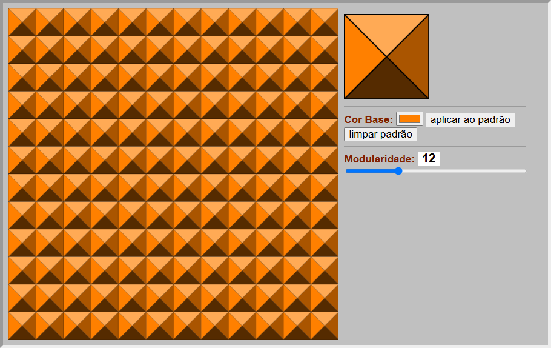

Project for the course Introduction to Web Programming (1st year). [Versão em Português](README.md)

## Project Structure

I was asked to develop 3 pages:

- `puzzle.html` - Page with an image puzzle.
- `ladrilho.html` - Generation and visualization of a tile (ladrilho) with dynamic patterns and colors.
- `arte/arte.html` - Small blog/gallery about painters and artworks.

## Puzzle

Page: `puzzle.html`

Main functions:

- Select and move the puzzle pieces.
- Interactive visualization.

	
	

## Tile (Ladrilho)

Page: `ladrilho.html`

Features:

- Generation of a modular grid.
- Application of triangular patterns with 4 colors.
- Possible adjustment of parameters (e.g.: modularity).

	
	

## Art Blog

Page: `arte/arte.html`

Features:

- Selection of painters via clickable elements and dropdown.
- Display of biography and list of works.
- Detailed visualization of each work.

	
	

	

