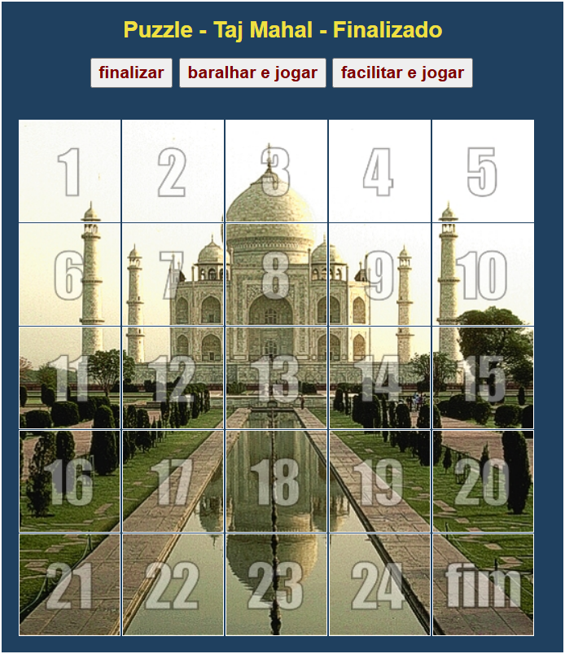
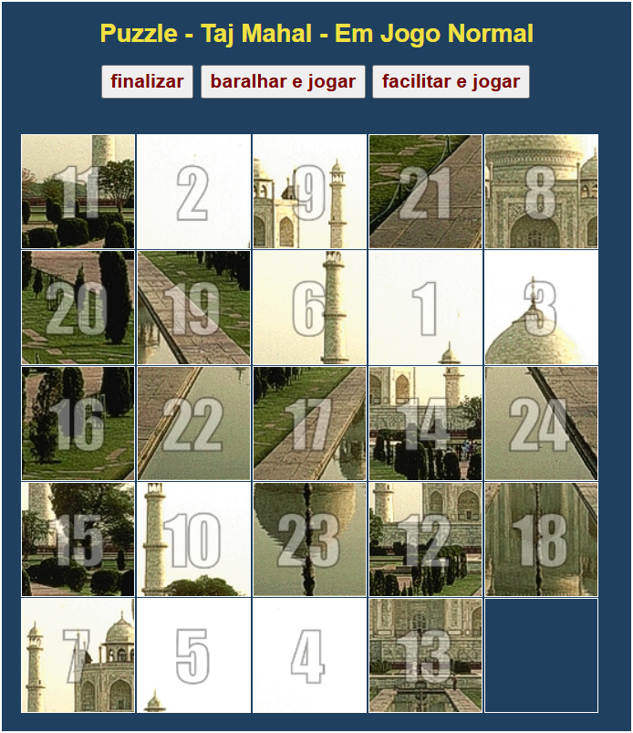
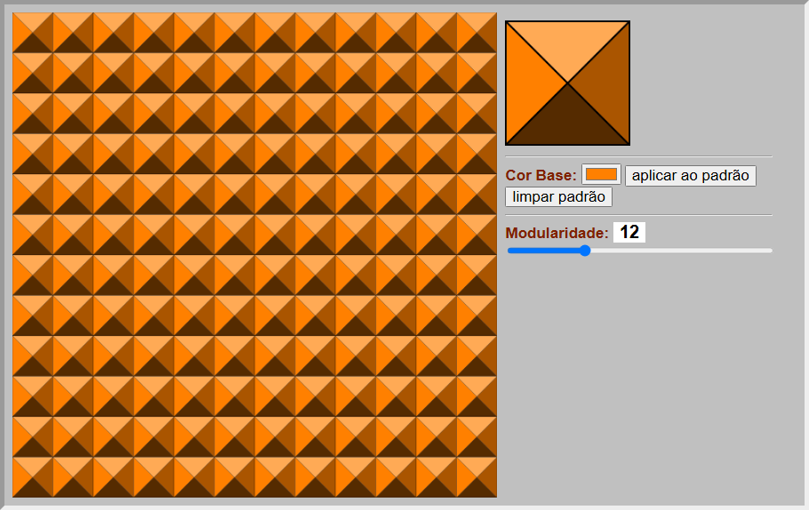
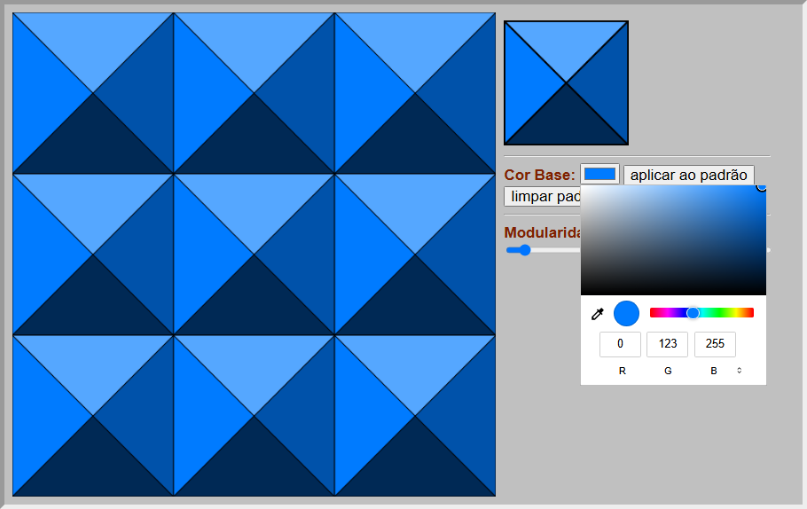
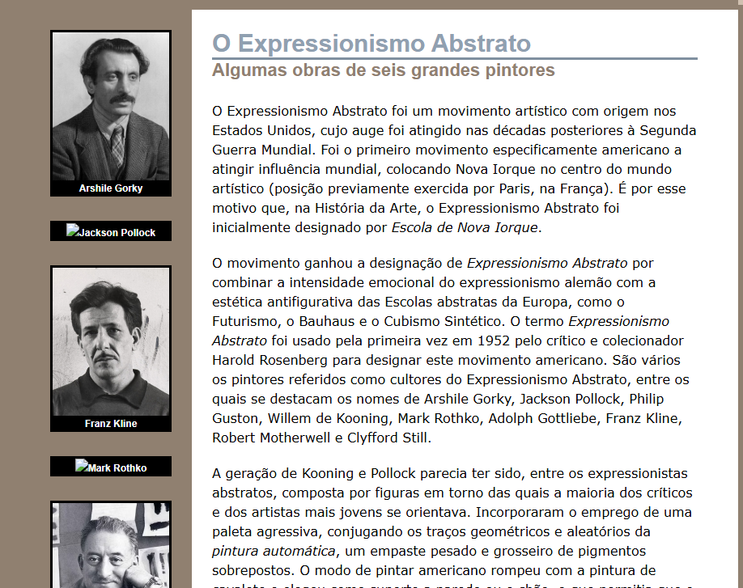
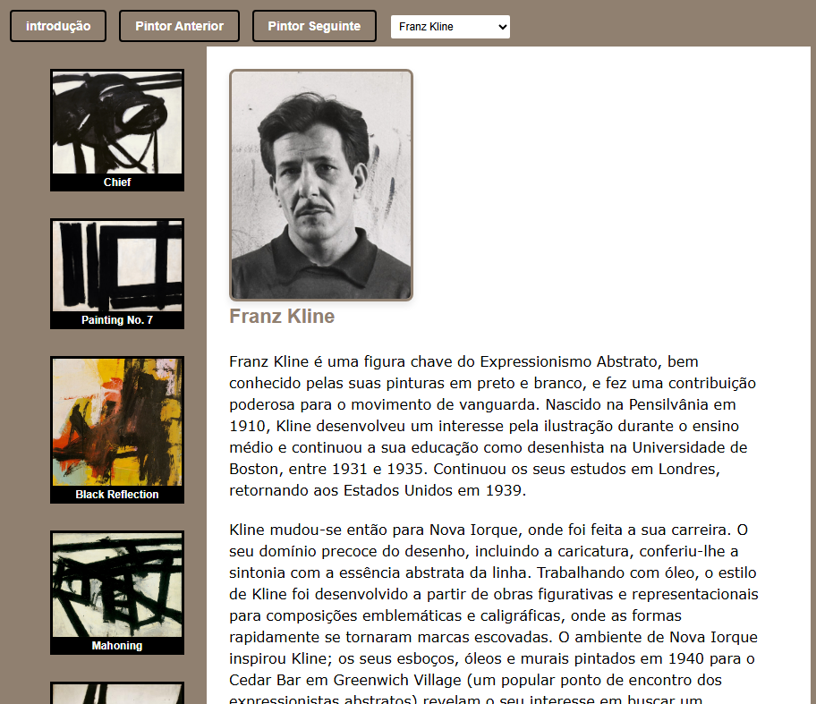
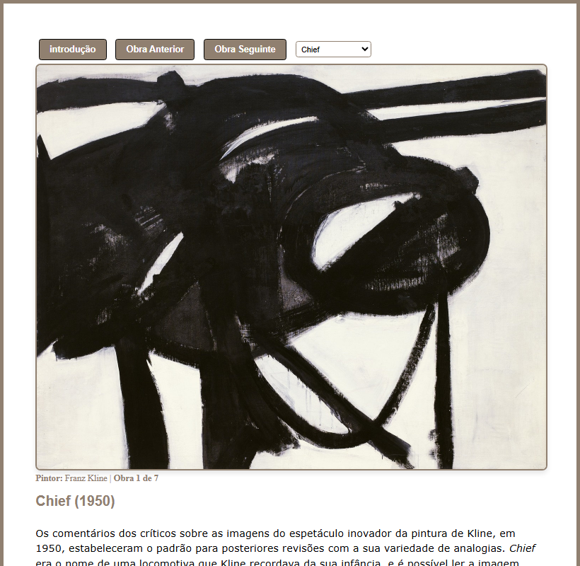

Projeto para a cadeira de Introdução à Programação Web (1º ano)

## Estrutura do Projeto

Foi-me pedido para desenvolver 3 páginas:

- `puzzle.html` - Página com um puzzle de imagens.
- `ladrilho.html` - Geração e visualização de um ladrilho com padrões e cores dinâmicas.
- `arte/arte.html` - Pequeno blogue/galeria sobre pintores e obras.

## Puzzle

Página: `puzzle.html`

Funções principais:

- Selecionar e mover as peças do puzzle.
- Visualização interativa.

	
	

## Ladrilho

Página: `ladrilho.html`

Funcionalidades:

- Geração de uma grelha modular.
- Aplicação de padrões triangulares com 4 cores.
- Possível ajuste de parâmetros (ex.: modularidade).

	
	

## Blogue de Arte

Página: `arte/arte.html`

Funcionalidades:

- Seleção de pintores via elementos clicáveis e dropdown.
- Visualização de biografia e lista de obras.
- Visualização detalhada de cada obra.

	
	

	

